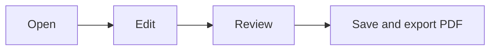

# Welcome to MarkGPT

Markdown editing and AI writing in one native workbench.

## Edit and preview

Use Source, Preview or Split to choose your view.

- **Bold**, *italic*, [Project](https://github.com/wangyeye/MarkGPT)
- [x] Manual editing
- [x] Live preview
- [ ] Connect your AI account

| Pane | Purpose |
|---|---|
| Left | Workspace folders and chats |
| Center | Editing and preview |
| Right | AI conversation and edits |

## Math

$$E=mc^2$$

## Diagrams

## AI editing

Connect a provider in Settings, enter an instruction and click **Edit Document**.

Review changes before applying, or enable automatic application. Concurrent manual changes are protected.

> Cmd+S saves; Cmd+P opens PDF export options.
