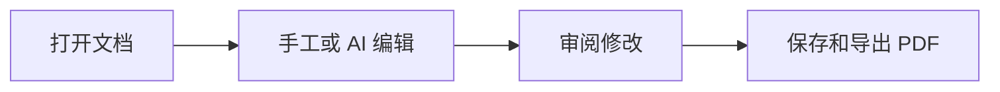

# 欢迎使用 MarkGPT

Markdown 文档和 AI 在同一个工作台中协作。

## 编辑与预览

在左侧编辑原文，右侧立即显示预览。通过上方按钮切换源码、预览或分屏。

- **粗体**、*斜体*、[项目主页](https://github.com/wangyeye/MarkGPT)
- [x] 手工编辑
- [x] 实时预览
- [ ] 连接你的 AI 账户

| 区域 | 用途 |
|---|---|
| 左侧 | 工作区文件和聊天列表 |
| 中间 | 编辑及预览 |
| 右侧 | AI 聊天和文档修改 |

## 数学公式

$$E=mc^2$$

## Mermaid 图表

## AI 修改

先在设置中连接供应商，再输入“把这篇文档改成简短的英文介绍”，点击 **修改文档**。

默认审阅修改后应用；也可以开启自动应用。回复期间的手工改动会被保留。

> Cmd+S 保存，Cmd+P 打开 PDF 导出选项。
